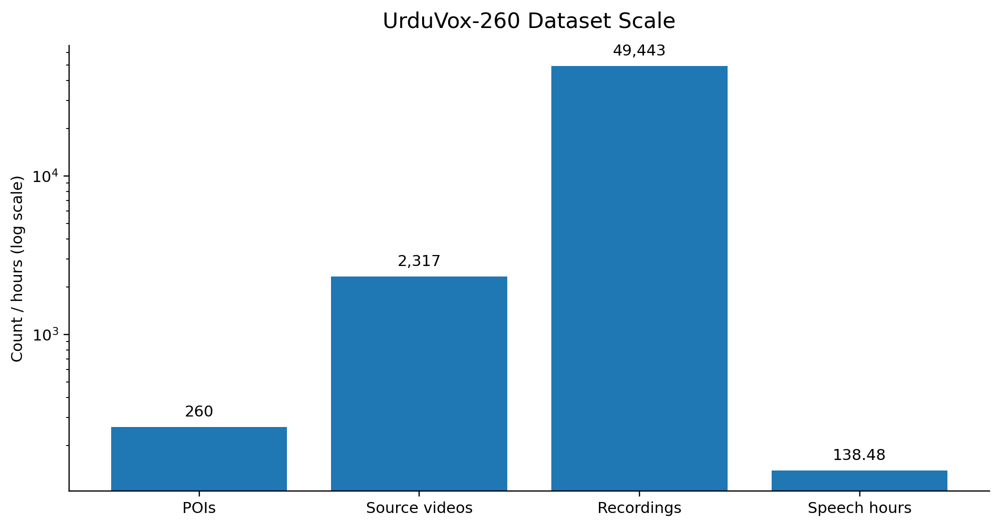
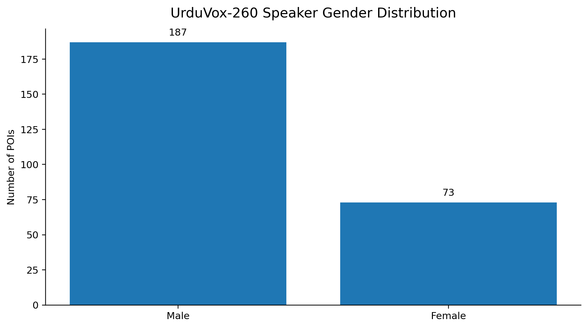
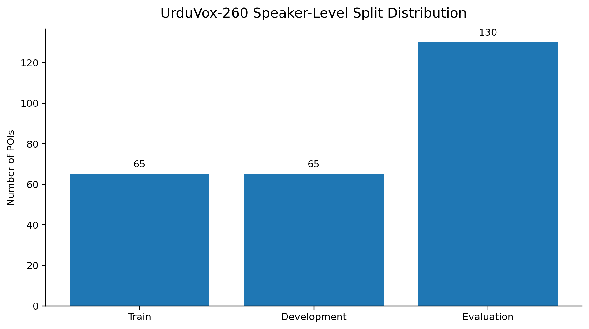
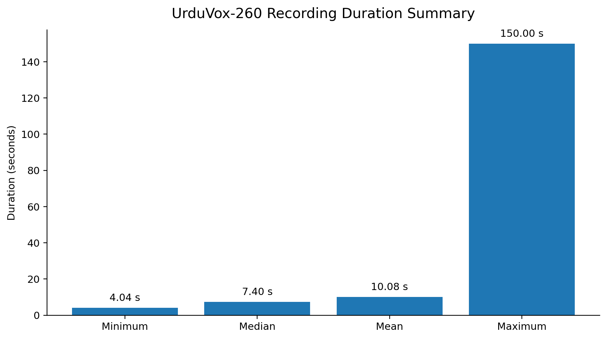

# UrduVox-260

> **UrduVox-260: A Large-Scale Audio-Visual Dataset of Urdu Speakers**

UrduVox-260 is an **in-the-wild audio-visual dataset for Urdu speaker-centric research**, curated from publicly available YouTube videos. The dataset contains recordings from **260 Persons of Interest (POIs)** and is designed to support research in **speaker identification, speaker verification, face–voice association, low-resource speech processing, and multimodal speaker modeling**.

The dataset accompanies our research paper currently being prepared for **ICASSP 2027**.

> **Dataset release:** [Coming soon — download/access link will be added here]  
> **Paper:** [Coming soon — paper/preprint link will be added here]  
> **Code:** [Coming soon — training/evaluation code will be added here]

---

## Overview

Large-scale, in-the-wild audio-visual resources for Urdu remain limited. UrduVox-260 addresses this gap by providing naturally occurring Urdu speech together with corresponding visual speaker information under diverse recording conditions.

The corpus was collected from public online multimedia and captures variability in:

- acoustic environments,
- recording devices and channels,
- background conditions,
- conversational and public-speaking contexts,
- visual appearance and scene conditions,
- multi-speaker recordings.

UrduVox-260 supports both **unimodal** and **cross-modal** speaker research.

<p align="center">
  
</p>

---

## Dataset at a Glance

| Metric | Value |
|---|---:|
| Number of POIs | **260** |
| Male POIs | **187** |
| Female POIs | **73** |
| Number of source videos | **2,317** |
| Number of recordings | **49,443** |
| Total speech duration | **138.48 h** |
| Recordings per POI | **636 / 190.17 / 8** |
| Duration per POI | **3.71 / 0.53 / 0.036 h** |
| Recordings per source video | **201 / 21.34 / 1** |
| Recording duration | **150.00 / 10.08 / 4.04 s** |
| Median recording duration | **7.40 s** |
| Standard deviation of recording duration | **12.50 s** |

For three-value entries, the order is **maximum / mean / minimum**.

---

## Speaker Distribution

UrduVox-260 contains **187 male** and **73 female** POIs.

<p align="center">
  
</p>

The supplied speaker metadata is divided into speaker-level training, development, and evaluation subsets.

<p align="center">
  
</p>

| Split | POIs |
|---|---:|
| Train | **65** |
| Development | **65** |
| Evaluation | **130** |
| **Total** | **260** |

---

## Audio Data

The audio component consists of **49,443 Urdu speech recordings** totaling approximately **138.48 hours**.

The recordings are extracted from unconstrained online videos rather than controlled recording environments. As a result, the audio naturally includes variation in recording channel, room acoustics, background noise, reverberation, speaking style, and conversational context.

### Audio statistics

| Statistic | Value |
|---|---:|
| Total recordings | **49,443** |
| Total duration | **138.48 h** |
| Recordings per POI | **636 / 190.17 / 8** |
| Duration per POI | **3.71 / 0.53 / 0.036 h** |
| Recordings per source video | **201 / 21.34 / 1** |
| Recording duration | **150.00 / 10.08 / 4.04 s** |
| Median recording duration | **7.40 s** |
| Recording-duration standard deviation | **12.50 s** |

<p align="center">
  
</p>

> Detailed utterance-level distributions and additional acoustic statistics can be added here once the final release metadata is prepared.

---

## Visual Data

UrduVox-260 retains the **visual speaker information corresponding to the speech recordings**, enabling audio-visual identity modeling in addition to audio-only experiments.

The visual processing stage uses face detection and tracking to create temporally continuous face tracks associated with speech regions. These tracks are then compared against reference images of the target identity so that retained samples are consistent in terms of **spoken language, speaker segmentation, and visual identity**.

The visual component is intended to support tasks such as:

- face–voice association,
- audio-visual speaker modeling,
- cross-modal identity representation learning,
- multimodal speaker verification,
- future audio-visual Urdu research.

### Visual statistics

Detailed release-level visual statistics such as the total number of face frames, face tracks, average track duration, face resolution distribution, and tracks per POI are **not yet finalized**.

> **Placeholder:** visual statistics will be added once the final release package and metadata are frozen.

---

## Dataset Collection Pipeline

UrduVox-260 is constructed using a multi-stage automated pipeline.

1. **Candidate speaker selection**  
   A predefined list of target speaker identities is used to initiate collection.

2. **Language-aware video retrieval**  
   Publicly available YouTube videos likely to contain the target speaker speaking Urdu are retrieved.

3. **Video filtering**  
   Candidate videos are filtered using duration, quality, and relevance criteria.

4. **Audio extraction and Urdu verification**  
   Audio is extracted and language verification is performed using Whisper.

5. **Speaker diarization**  
   Temporally localized speaker turns are identified and unsuitable segments are filtered.

6. **Face detection and tracking**  
   Visible faces are detected and tracked to form continuous face tracks associated with the speech regions.

7. **Identity verification**  
   Face tracks are compared with reference images of the target identity.

8. **Final audio-visual sample generation**  
   Samples are retained when language, speaker segmentation, and visual identity are mutually consistent.

> **Pipeline figure:** [Placeholder — add the final UrduVox-260 collection-pipeline figure here]

---

## Supported Benchmark Tasks

### 1. Closed-Set Speaker Identification

Given a test speech recording from a known speaker, the objective is to predict the corresponding enrolled identity.

The current benchmark reports:

- Top-1 accuracy
- Top-5 accuracy

Representative baselines include:

- x-vector
- ECAPA-TDNN
- UniSpeech-SAT-SV
- WavLM-SV

### 2. Text-Independent Speaker Verification

Speaker verification determines whether two speech recordings belong to the same speaker.

The benchmark uses a **speaker-disjoint evaluation protocol** and reports:

- Equal Error Rate (EER)
- minimum Detection Cost Function (minDCF)

Additional operating-point statistics may be included in future releases.

### 3. Face–Voice Association

Face–voice association determines whether a face representation and voice representation correspond to the same identity.

Representative baselines include:

- Learnable Pins
- DIMNet
- FOP

The benchmark reports:

- Equal Error Rate (EER)
- Area Under the ROC Curve (AUC)

Both standard and gender-constrained evaluation settings are considered.

---

## Benchmark Protocols

| Setting | Speaker Identification | Speaker Verification / Face–Voice Association |
|---|---|---|
| Task | Closed-set | Text-independent, open-set |
| Speaker protocol | Shared identities | Speaker-disjoint |
| Partition | 70/15/15% by video | 80/20% speaker split |
| Pairing | — | 2 target + 2 impostor trials per anchor |

> The final protocol files and exact repository paths will be documented here when the public release is prepared.

---

## Baseline Results

### Speaker Recognition

| Backbone | Top-1 (%) ↑ | Top-5 (%) ↑ | EER (%) ↓ | minDCF ↓ |
|---|---:|---:|---:|---:|
| **ECAPA-TDNN** | **84.94 ± 0.77** | **90.26 ± 0.65** | **15.11 ± 1.26** | **0.615 ± 0.013** |
| x-vector | 80.00 ± 1.35 | 87.51 ± 0.65 | 16.28 ± 0.92 | 0.717 ± 0.063 |
| UniSpeech-SAT-SV | 71.32 ± 0.87 | 83.39 ± 0.81 | 25.70 ± 0.86 | 0.907 ± 0.014 |
| WavLM-SV | 71.92 ± 0.44 | 83.12 ± 0.22 | 29.90 ± 5.13 | 0.933 ± 0.016 |

Results are reported as **mean ± standard deviation over three random seeds**.

### Face–Voice Association

| Method | Standard EER (%) ↓ | Standard AUC (%) ↑ | Gender-Constrained EER (%) ↓ | Gender-Constrained AUC (%) ↑ |
|---|---:|---:|---:|---:|
| Learnable Pins | 29.25 ± 3.88 | 76.96 ± 4.87 | **39.12 ± 1.51** | **65.23 ± 1.24** |
| DIMNet | 30.18 ± 0.56 | 76.71 ± 0.63 | 41.67 ± 1.03 | 61.27 ± 1.37 |
| **FOP** | **28.76 ± 0.68** | **78.15 ± 0.51** | 42.44 ± 0.47 | 60.12 ± 0.12 |

---

## Dataset Access
The public hosting platform for UrduVox-260 has not yet been finalized.

> **Download:** [DATASET DOWNLOAD LINK — TO BE ADDED]

Once released, this section should describe:

- download location,
- access procedure,
- archive structure,
- metadata format,
- protocol files,
- checksums/version information,
- any applicable terms of use.

---

## Repository Structure

The final GitHub repository structure has not yet been frozen. A possible layout is shown below and can be replaced once the release repository is prepared.

```text
UrduVox-260/
├── README.md
├── assets/
│   ├── dataset_scale_overview.png
│   ├── speaker_gender_distribution.png
│   ├── speaker_split_distribution.png
│   ├── recording_duration_summary.png
│   └── UrduVox260_pipeline.png
├── metadata/
│   └── speakers.tsv
├── protocols/
│   ├── identification/
│   ├── verification/
│   └── face_voice/
├── scripts/
│   ├── [download/preprocessing scripts]
│   └── [evaluation scripts]
├── LICENSE
└── CITATION.cff
```

> This structure is currently a **placeholder** and does not imply that these files have already been released.

---

## Metadata

The current speaker-level metadata is provided in:

```text
metadata/speakers.tsv
```

It contains **260 rows corresponding to 260 dataset POIs** and four fields:

| Field | Description | Values / Format |
|---|---|---|
| `ID` | Unique dataset identifier assigned to each POI | `ID001` ... `ID260` |
| `original_name` | Original speaker-name label used in the dataset metadata | String |
| `gender` | Gender label associated with the POI | `M` = male, `F` = female |
| `split` | Speaker-level dataset partition | `train`, `dev`, `eval` |

### Speaker-level metadata summary

| Category | Count |
|---|---:|
| Total POIs | **260** |
| Male (`M`) | **187** |
| Female (`F`) | **73** |
| Train | **65** |
| Development | **65** |
| Evaluation | **130** |

### Example entries

| ID | original_name | gender | split |
|---|---|---|---|
| `ID001` | `Dr_waseem` | `M` | `eval` |
| `ID002` | `M waeem professor` | `M` | `train` |
| `ID003` | `M_waseem_boxer` | `M` | `eval` |
| `ID004` | `Muniba_Mazari` | `F` | `dev` |
| `ID005` | `Musaddiq_Malek` | `M` | `eval` |
| `ID006` | `Pervez_musharraf` | `M` | `eval` |

The metadata file is **speaker-level metadata**. Each row defines one POI and its assigned speaker-disjoint partition. The `original_name` field preserves the dataset's original identity label and should be treated as the canonical label used by the released metadata unless a separate normalized-name mapping is provided in a future release.

> Additional recording-level, source-video-level, face-track, and benchmark-protocol metadata will be documented here if they are included in the final public release.

---

## Usage

Code and example usage will be added once the public release format and accompanying scripts have been finalized.

```bash
# Placeholder
git clone <REPOSITORY_URL>
cd UrduVox-260

# Dataset preparation / evaluation commands will be added here.
```

## Citation

If you use UrduVox-260 in your research, please cite the associated paper.

```bibtex
@inproceedings{urduvox260_2027,
  title     = {UrduVox-260: A Large-Scale Audio-Visual Dataset of Urdu Speakers},
  author    = {[AUTHORS TO BE FINALIZED]},
  booktitle = {Proceedings of the IEEE International Conference on Acoustics, Speech and Signal Processing (ICASSP)},
  year      = {2027},
  note      = {[PLACEHOLDER — replace with final bibliographic information after publication]}
}
```

> **Paper/preprint URL:** [TO BE ADDED]

---

## Acknowledgments

This research was funded in whole or in part by the **Austrian Science Fund (FWF), Cluster of Excellence Bilateral Artificial Intelligence**, and the **Higher Education Commission, Pakistan**.

Additional funding and acknowledgment details will follow the final paper.

---

## Contact

For questions regarding UrduVox-260:

**[CONTACT NAME / EMAIL TO BE ADDED]**

---

## Status

🚧 **UrduVox-260 is currently being prepared for public release.**

The dataset download link, repository contents, code, license, final metadata schema, and citation information will be updated when the release is finalized.

